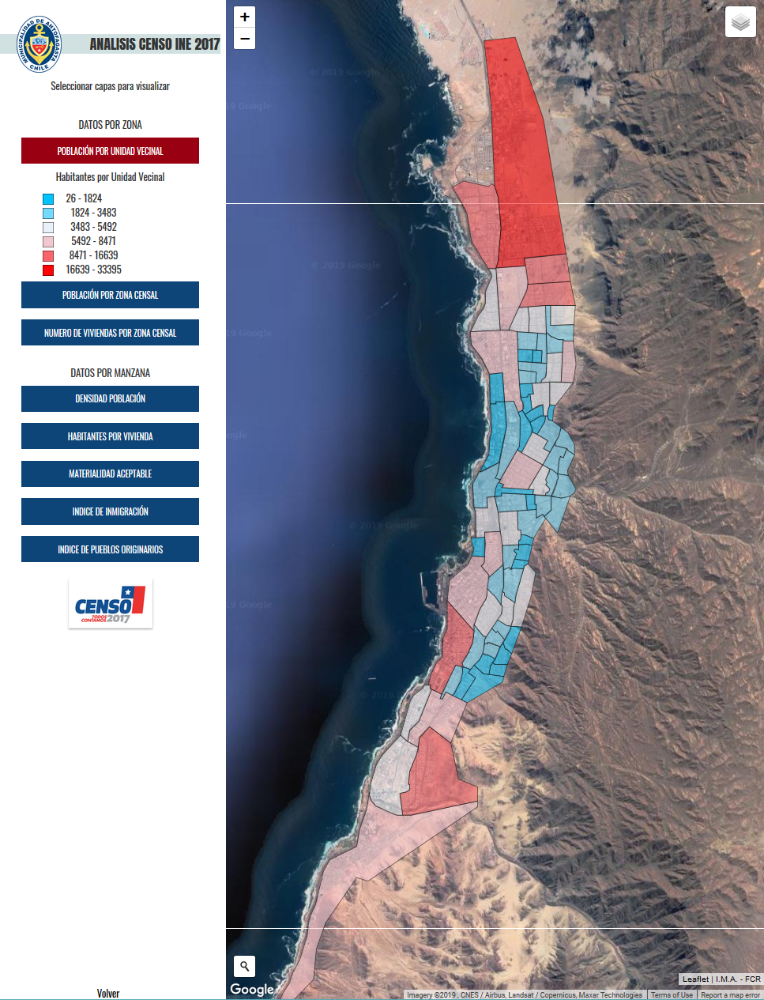

# visualizacion_analisis_censo_leaflet
Análisis de información Censo 2017, parte de geoportal Ilustre Municipalidad de Antofagasta 

1. Población por Unidad Vecinal
1. Población por Zona Censal
1. Número de Viviendas por Zona Censal

1. Densidad de Población
1. Habitantes por Vivienda
1. Materialidad Aceptable
1. Indice de Inmigración
1. Indice de Pueblos Originarios

